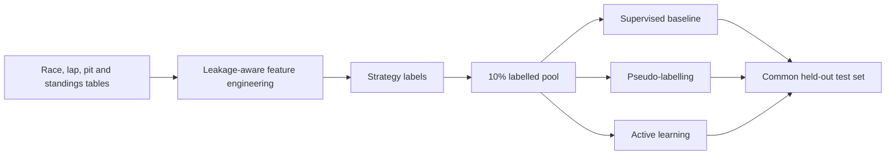

<div align="center">

# F1 Pit Strategy via SSL and Active Learning

**Learning race strategy when labels are scarce but historical timing data is abundant**

[](https://github.com/Mahdi-Jadidi/f1-pit-strategy-ssl-active-learning/actions/workflows/ci.yml)


</div>

## Overview

This repository studies pit-strategy classification under a realistic constraint: only 10% of the available race records are treated as labelled. It builds strategy features from Ergast-style Formula 1 tables, establishes a supervised baseline, and compares pseudo-labelling with three active-learning acquisition policies.

The target classes are `Standard`, `Undercut`, `Overcut`, and `Emergency`.

## Key results

| Method | Labelled samples | Accuracy | Macro F1 |
|---|---:|---:|---:|
| Gradient Boosting baseline | 668 | 88.10% | 0.8605 |
| Active learning: least confidence | 828 | 89.29% | 0.8819 |
| Active learning: margin | 828 | **91.67%** | **0.8995** |
| Active learning: entropy | 828 | 82.14% | 0.7980 |
| Best pseudo-labelling run | 668 initial | 88.10% | 0.8605 |

Margin sampling delivered the best result with only 160 additional oracle labels. Aggressive pseudo-labelling added thousands of samples but reduced Macro F1, showing that more labels are not useful when their noise overwhelms the signal.

## Experiment design



## Highlights

- Auditable rule-based strategy labels and deterministic pool construction.
- Logistic regression, random forest, and gradient boosting baselines.
- Confidence thresholds from 0.55 to 0.85 with multi-round pseudo-labelling.
- Least-confidence, margin, and entropy query policies under the same budget.
- Plateau detection and round-by-round class acquisition histories.

## Repository layout

```text
src/f1_pit_strategy/
├── data.py, features.py, labeling.py
├── models.py
├── semi_supervised.py
├── active_learning.py
├── pipeline.py
└── cli.py
```

## Quick start

```bash
git clone https://github.com/Mahdi-Jadidi/f1-pit-strategy-ssl-active-learning.git
cd f1-pit-strategy-ssl-active-learning
pip install -e .
f1-pit-strategy run --data-dir . --output-dir outputs
```

Prepared runs require `labeled.csv` and `unlabeled.csv`. Add `--oracle-unlabeled` when the pool includes hidden strategy labels for active-learning simulation. Raw Ergast-style tables can be converted with the `prepare` command.

## Outputs

The pipeline exports baseline metrics, pseudo-labelling history, active-learning history, class-level ROC-AUC, comparative summaries, plateau analysis, and serialized best estimators.

## Limitations

The labels are analytical proxies derived from historical race signals, not official team strategy calls. Results should be interpreted as a controlled label-efficiency study rather than a live race-decision system.
